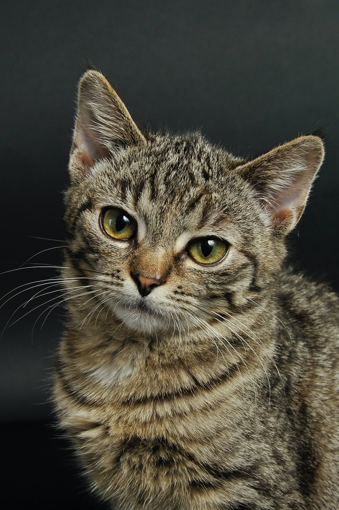

### Abstract Class dan Interface

---

### Abstract Class

adalah `class` yang tidak bisa dibuat object, nah class ini biasa digunakan sebagai class dasar (*template*)
cara penggunaan nya cukup inherit/wariskan kepada `class` lain

#### Analogi

klo diibaratkan analogi abstract class itu seperti bentuk umum suatu object katakanlah `kucing`



nah kucing kan ada berbagai jenis misalnya

* anggora
* persia


kalo kita ingin katakan jenis kucing secara spesifik misalnya `kucing anggora` nah kata kucing ini harusnya
terdapat berbagai jenis dan kita tidak bisa langsung menyimpulkan itu kucing (*kalo pengen spesifik*)

sama juga berlaku untuk `class` kita ga bisa langsung membuat object yang menyatakan itu adalah `Monster`
tanpa mengetahui jenisnya


nah untuk itu kita perlu membuat `abstract class` agar si class induk tidak bisa dibuat object
tapi harus diwariskan dulu agar bisa dipake di class lain

contohnya

```dart
// tampung object
List monsters = [];

// add object
monsters.add(MonsterUbur());
monsters.add(MonsterBurung());
monsters.add(Monster());
```

lengkapnya

```dart
import 'package:absract_class/hero.dart';
import 'package:absract_class/monster.dart';
import 'package:absract_class/monster_burung.dart';
import 'package:absract_class/monster_ubur.dart';

void main(List<String> arguments) {
  Hero hero = new Hero();
  Monster m = new MonsterBurung();

  // objects baru
  MonsterUbur ubur = new MonsterUbur();
  MonsterBurung burung = new MonsterBurung();

  // tampung object
  List monsters = [];

  // add object
  monsters.add(MonsterUbur());
  monsters.add(MonsterBurung());
  monsters.add(Monster());

  // keyword as
  print('monster burung');
  print((m as MonsterBurung).fly());

  for (Monster monster in monsters) {
    if (monster is MonsterBurung) {
      print(monster.eatHuman());
    }
  }
}
```

kita buat object dari class `Monster` bisa karena blom di abstract

hasilnya

```
monster burung
woosh
yummy
```
beda lagi klo kita ubah class monsternya kaya gini

```dart
import 'package:absract_class/character.dart';

abstract class Monster extends Character {
  String eatHuman() => 'yummy';
}
```

dan kita jalankan lagi hasilnya pasti error

```
bin/absract_class.dart:20:16: Error: The class 'Monster' is abstract and can't be instantiated.
  monsters.add(Monster());
               ^^^^^^^
```

> Note: karena class `Monster` difungsikan sebagai template maka ga wajib punya `method` yang ada
> implementasinya

studi kasusnya ketika kita lihat class `monster`, setiap monster pasti bisa berjalan kan dan caranya pasti beda beda
nah dalam `abstract class` kita bisa tambah method misalnya `move()` tapi kita ga beri implentasi si method ini harus ngapain


```dart
import 'package:absract_class/character.dart';

abstract class Monster extends Character {
  String eatHuman() => 'yummy';
  String move();
}
```
nah implementasi methodnya di class yang mewarisi `class monster` nanti

nah sekarang kita ubah semua turunan dari class `Monster` mengoverride method dari si `Monster` menggunakan
`@override`

```dart
// lib/monster_burung.dart

import 'package:absract_class/monster.dart';

class MonsterBurung extends Monster {
  String fly() {
    return 'woosh';
  }

  @override
  String move() {
    return 'pake sayap';
  }
}
```

```dart
// lib/monster_ubur.dart

import 'package:absract_class/monster.dart';

class MonsterUbur extends Monster {
  String berenang () => 'slup slup';

  @override
  String move() {
    return 'berenang renang';
  }
}
```

nah klo kita panggil

```dart
for (Monster monster in monsters) {
    if (monster is MonsterBurung) {
      print(monster.eatHuman());
      print('cara jalan');
      print(monster.move());
   }
}
```

lengkapnya

```dart
import 'package:absract_class/hero.dart';
import 'package:absract_class/monster.dart';
import 'package:absract_class/monster_burung.dart';
import 'package:absract_class/monster_ubur.dart';

void main(List<String> arguments) {
  Hero hero = new Hero();
  Monster m = new MonsterBurung();

  // objects baru
  MonsterUbur ubur = new MonsterUbur();
  MonsterBurung burung = new MonsterBurung();

  // tampung object
  List monsters = [];

  // add object
  monsters.add(MonsterUbur());
  monsters.add(MonsterBurung());
  // keyword as
  print('monster burung');
  print((m as MonsterBurung).fly());

  for (Monster monster in monsters) {
    if (monster is MonsterBurung) {
      print(monster.eatHuman());
      print('cara jalan');
      print(monster.move());
    }
  }
}
```

hasilnya

```
monster burung
woosh
yummy
cara jalan
pake sayap
```

disini kita bisa juga override method sudah ada implementasinya contoh 

```dart
  // new object
  @override
  String eatHuman() {
    return 'sruput';
  }
```

lengkap implementasinya bisa disini

```dart
import 'package:absract_class/monster.dart';

class MonsterBurung extends Monster {
  String fly() {
    return 'woosh';
  }

  @override
  String move() {
    return 'pake sayap';
  }

  // new object
  @override
  String eatHuman() {
    return 'sruput';
  }
}
```

ketika dijalankan hasilnya

```
monster burung
woosh
sruput
cara jalan
pake sayap
```
### Interface

sama seperti `abstract class` `interface` adalah template untuk mengumpulkan method/property yang
harus dimiliki oleh `class` yang mengimplement interface tadi

dalam bahasa dart ga punya interface nah untuk membuatnya kita bisa buat `abstract class` seperti ini

```dart
abstract class FlyingMonster {
  String fly();
}
```

kemudian kita buat class monster baru

```dart
import 'package:absract_class/flying_monster.dart';
import 'package:absract_class/monster_ubur.dart';

class MonsterDragon extends MonsterUbur implements FlyingMonster {
  @override
  String fly() {
    return 'terbang tinggi grr!!!';
  }
}

```

kemudian kita add ke list seperti ini

```dart

```

### Apa Bedanya?

sebuah `class` hanya bisa `extends` dari satu parrent class aja, klo `implements` bisa banyak `interface`

contoh

```dart
// lib/flying_monster.dart

abstract class FlyingMonster {
  String fly();
}

abstract class DemonSlayer {
  String killerDemons();
}
```

kemudian kita implements 

```dart
// lib/monster_dragon.dart

import 'package:absract_class/flying_monster.dart';
import 'package:absract_class/monster_ubur.dart';

class MonsterDragon extends MonsterUbur implements FlyingMonster, DemonSlayer {
  @override
  String fly() {
    return 'terbang tinggi grr!!!';
  }

  @override
  String killerDemons() {
    return 'Demon is a weak grr';
  }
}

```

---

[inheritance](../inherit/README.md)  <>  [Mixins](../mixins/README.md)
